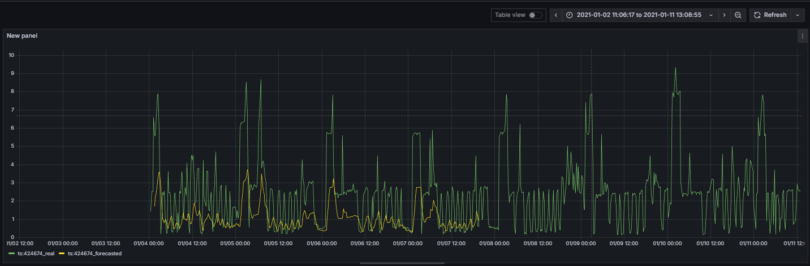
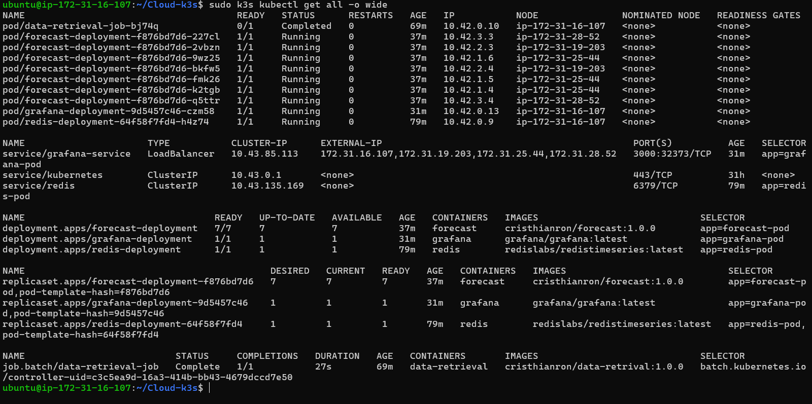

# Kubernetes Lab - k3s

We have just done the Kubernetes exercise where the forecasting was deployed to a "Kind" cluster.

For the lab, you will repeat the Kubernetes exercise but deploy all the services to a k3s cluster instead of a "Kind" Cluster. 

For the k3s cluster, please deploy a control-plane node and join three worker nodes. i.e. You will need 4 VMs in the choice of Cloud provider that you have credentials so far.

The worker nodes should be minimal to save costs (1CPU, 2GB RAM at most), while the control-plane node should be aprox. 2 CPU, 4GB RAM instance. Ensure you have sufficient disk space on the control-plane (about 50GB), while 30GB should suffice on the workers.

The only pods that should be deployed to the worker nodes are the forecasts, which you should reduce to 7, and everything else should run on the control-plane (Redis, Grafana, and Data Retrieval)

Note: be careful sizing the worker VMs as they can crash if too small... but the smaller they are, the better for costs. You could also consider working on reducing the size of the forecast image? I think currently is approx 2GB. Maybe compressing or using some other libraries? Just some ideas.

You shall submit a report detailing what you have done, and any issues you have encountered. The report should include, at least:

* detail all the steps you took to deploy to k3s
* A screen-capture of the running Grafana instance that shows the data from real and forecast. With a routable IP address (meaning, showing the IP address of the instance which hosts the control-plane).
* A screen capture of `kubectl get all -o wide` that will show what pods are running where in your cluster.

# Task 0 : Setting up the k3s cluster

We will create firstly 4 VMs for control-plane and worker nodes. We will use AWS an t3.small instances for worker nodes and t2.medium for control-plane node with 50 GB of disk space for control-plane and 30 GB for worker nodes.


Install k3s on the control-plane node:
```bash
curl -sfL https://get.k3s.io | sh -
```

Get the join token from control-plane node:
```bash
ubuntu@ip-172-31-16-107:~$ hostname -I
172.31.16.107 10.42.0.0 10.42.0.1
ubuntu@ip-172-31-16-107:~$ sudo cat /var/lib/rancher/k3s/server/node-token
K10bcf011d424034d21694dacf610abea2e2c1a94ef03226a2a35593e2a88e2952d::server:924aebc21fd66d3ecec96212aedb5d07
```

And now install k3s on worker nodes:
```bash
curl -sfL https://get.k3s.io | \
  K3S_URL="https://172.31.16.107:6443" \
  K3S_TOKEN="K10bcf011d424034d21694dacf610abea2e2c1a94ef03226a2a35593e2a88e2952d::server:924aebc21fd66d3ecec96212aedb5d07" \
  sh -
```

Now, we can check the nodes from control-plane node:
```bash
ubuntu@ip-172-31-16-107:~$ sudo k3s kubectl get nodes
NAME               STATUS   ROLES                  AGE    VERSION
ip-172-31-16-107   Ready    control-plane,master   27h    v1.33.5+k3s1
ip-172-31-19-203   Ready    <none>                 108s   v1.33.5+k3s1
ip-172-31-25-44    Ready    <none>                 14m    v1.33.5+k3s1
ip-172-31-28-52    Ready    <none>                 58s    v1.33.5+k3s1
```
> We can see that we have 4 nodes in the cluster. A control-plane node and 3 worker nodes.

Now we can proceed to deploy the forecasting application as in the previous lab but using k3s kubectl command:
```bash
sudo k3s kubectl apply -f deployment/redis-deployment.yaml

We will clone the repo of the previous lab to have all the deployment files.
```

We will add roles to each node to ensure that only forecast pods run on worker nodes.

```bash
# Master
sudo k3s kubectl label node ip-172-31-16-107 role=infra --overwrite

# Workers
sudo k3s kubectl label node ip-172-31-19-203 workload=forecast --overwrite
sudo k3s kubectl label node ip-172-31-25-44  workload=forecast --overwrite
sudo k3s kubectl label node ip-172-31-28-52  workload=forecast --overwrite
```

# Task 1: Redis deployment
1. Add to the redis-deployment.yaml a nodeSelector to ensure that Redis pod runs only on control-plane node.

2. Deploy the redis module using k3s kubectl.
```bash
ubuntu@ip-172-31-16-107:~/Cloud-k3s$ sudo k3s kubectl apply -f deployment/redis-deployment.yaml
deployment.apps/redis-deployment created
service/redis created
```

# Task 2: Data Retrieval deployment

1. We add secrets for AWS credentials as in the previous lab.
```bash
sudo k3s kubectl create secret generic aws-creds \
  --from-literal=AWS_ACCESS_KEY_ID="TON_ACCESS_KEY" \
  --from-literal=AWS_SECRET_ACCESS_KEY="TON_SECRET_KEY"

2. Add to the data-retrieval-deployment.yaml a nodeSelector to ensure that Data Retrieval pod runs only on control-plane node.

3. Deploy the data-retrieval module using k3s kubectl
```bash
sudo k3s kubectl apply -f deployment/data-retrieval-deployment.yaml

ubuntu@ip-172-31-16-107:~/Cloud-k3s$ sudo k3s kubectl get jobs
NAME                 STATUS     COMPLETIONS   DURATION   AGE
data-retrieval-job   Complete   1/1           27s        2m19s
```

# Task 3: Forecast deployment

1. Add to the forecast-deployment.yaml a nodeSelector to ensure that Forecast pods run only on worker nodes.

2. Deploy the forecast module using k3s kubectl. Keep in mind that data-retrieval deployment must finish its execution before deploying the forecast module. Use "kubectl logs" to ensure that the data-retrieval module has finished.
```bash
sudo k3s kubectl apply -f deployment/forecast-deployment.yaml
```

Verify that all forecast pods are running on worker nodes:
```bash
ubuntu@ip-172-31-16-107:~/Cloud-k3ssudo k3s kubectl get pods -l app=forecast-pod -o widede
NAME                                  READY   STATUS    RESTARTS   AGE   IP          NODE               NOMINATED NODE   READINESS GATES
forecast-deployment-f876bd7d6-227cl   1/1     Running   0          40s   10.42.3.3   ip-172-31-28-52    <none>           <none>
forecast-deployment-f876bd7d6-2vbzn   1/1     Running   0          40s   10.42.2.3   ip-172-31-19-203   <none>           <none>
forecast-deployment-f876bd7d6-9wz25   1/1     Running   0          40s   10.42.1.6   ip-172-31-25-44    <none>           <none>
forecast-deployment-f876bd7d6-bkfw5   1/1     Running   0          40s   10.42.2.4   ip-172-31-19-203   <none>           <none>
forecast-deployment-f876bd7d6-fmk26   1/1     Running   0          40s   10.42.1.5   ip-172-31-25-44    <none>           <none>
forecast-deployment-f876bd7d6-k2tgb   1/1     Running   0          40s   10.42.1.4   ip-172-31-25-44    <none>           <none>
forecast-deployment-f876bd7d6-q5ttr   1/1     Running   0          40s   10.42.3.4   ip-172-31-28-52    <none>           <none>
ubuntu@ip-172-31-16-107:~/Cloud-k3s$ sudo k3s kubectl rollout status deploy/forecast-deployment
deployment "forecast-deployment" successfully rolled out
```

# Task 4: Grafana deployment

1. Add to the grafana-deployment.yaml a nodeSelector to ensure that Grafana pod runs only on control-plane node.

2. Deploy the grafana module using k3s kubectl
```bash
sudo k3s kubectl apply -f deployment/grafana-deployment.yaml
configmap/grafana-config created
persistentvolume/grafana-pv created
persistentvolumeclaim/grafana-pvc created
deployment.apps/grafana-deployment created
service/grafana-service created

sudo k3s kubectl get pods -l app=grafana-pod -o wide
NAME                                 READY   STATUS    RESTARTS   AGE   IP           NODE               NOMINATED NODE   READINESS GATES
grafana-deployment-9d5457c46-czm58   1/1     Running   0          55s   10.42.0.13   ip-172-31-16-107   <none>           <none>
```

# Task 5: Load Balancer

1. In our cluster, grafana is running on control-plane node. The service is only accessible from within the cluster. To access grafana from outside the cluster, we will use a port-forwarding as in the previous lab but using k3s kubectl command:

```bash
sudo k3s kubectl port-forward service/grafana 3000:3000
```

> This will create a tunnel between service to control-plane. We will redirect port 3000 of service in k3s towards port 3000 of control-plane node in VM control-plane.

2. Now, we will create a ssh tunnel from vm to our local machine to access grafana from our local browser:

```bash
ssh -i Worker-1.pem -L 3000:localhost:3000 ubuntu@ec2-98-93-19-241.compute-1.amazonaws.com
```

3. Now we can access grafana from our local browser using the url: `http://localhost:3000`

# Task 6 : Grafana Dashboard

Access the grafana interface using `http://localhost:3000` and create a dashboard to visualize real and forecast data as in the previous lab.

The username and password to access grafana are both "admin".

1. Dashboard View:


In the dashboard, we can see the forecasted data and real data but it is important to note that the vm are small and the forecast pods take time to process the data, so like the image shown not all the real data is forecasted. If we wait more time, all the real data will be forecasted but we can see that the real data and the a half forecasted data are present.

2. command to see all running pods in the cluster:
```bash
sudo k3s kubectl get all -o wide
```



