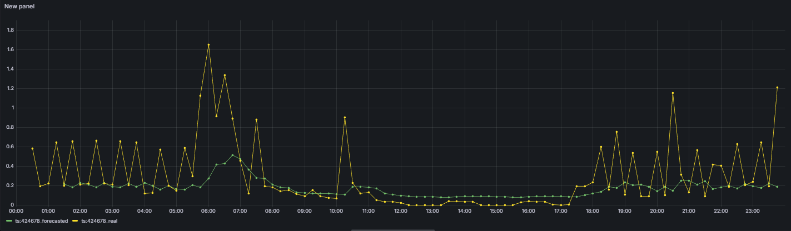
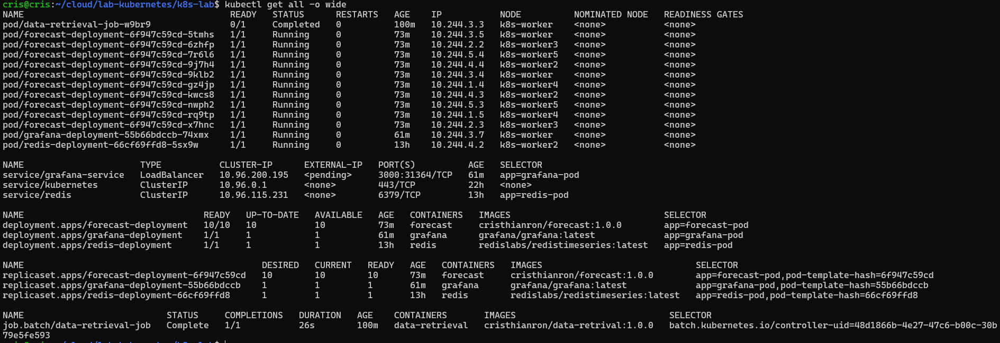

Create a kind cluster with a configuration file

```bash
kind create cluster --config kind-config.yaml --name k8s
```

Use cluster create before 
```bash
kubectl cluster-info --context kind-k8s
```
## Task 1: Redis deployment
1. Fill the redis-deployment.yaml
2. Deploy the redis module using kubectl.
```bash
kubectl apply -f deployment/redis-deployment.yaml
```

## Task 2: Data Retrieval deployment
The data-retrieval module must access the S3 object storage to read the CSV file containing the electrical consumption. You must therfore use the AWS Acess key and secret key. We use "secrets" to propagate confidential data through the cluster. Read the data-retrieval-deployment.yaml carefully and find out where the secrets should be used. The secrets must be generated by the following command:

```bash
kubectl create secret generic <name-of-the-secrets> \
  --from-literal=AWS_ACCESS_KEY_ID=<Your access key> \
  --from-literal=AWS_SECRET_ACCESS_KEY=<your secret key>

  name-of-the-secrets>: aws-creds (use in yaml file)
```
1. Build the Data Retrieval docker and push it to your dockerhub account
```bash
docker build -t cristhianron/data-retrieval:1.0.0 ./deployment/data-retrieval/.
docker push cristhianron/data-retrieval:1.0.0
```
2. Complete the file "data-retrieval-deployment.yaml"
3. Deploy the data-retrieval module using kubectl
```bash
kubectl apply -f deployment/data-retrieval-deployment.yaml
```
see if we don't have any errors
```bash
kubectl logs -f job/data-retrieval-job
kubectl describe pod data-retrieval-job
```
delete job
```bash
kubectl delete job data-retrieval-job
```
see if we can get the container image push before
```bash
docker pull docker.io/cristhianron/data-retrival:1.0.0
```

### Task 3: Forecast deployment

1. Build the container and push it to your dockerhub account
```bash
docker build -t cristhianron/forecast:1.0.0 ./deployment/forecast/.
docker push cristhianron/forecast:1.0.0
```
2. Fill the forecast-deployment.yaml
3. Deploy the forecast module using kubectl. Keep in mind tha data-retrieval deployment must finish its execution before deploying the forecast module. Use "kubectl logs" to ensure that the data-retrieval module has finished.
```bash
kubectl apply -f deployment/forecast-deployment.yaml
```

### Task 4: Grafana deployment

Fill the grafana-deployment.yaml and deploy.
```bash
kubectl apply -f deployment/grafana-deployment.yaml
```

### Task 5: Load Balancer

Kubernetes provides Load Balancing capabilities natively. This permits the distribution of load between several replicas of the same pod. But, as we are deploying using kind, to access this ability we have to create a port-forward between the service and the host device:

```bash
kubectl port-forward service/grafana-service 3000:3000
```

In this case we only require one port forward, between the grafana service (the frontend to this service), and the host. Once this PF is established, we are able to access the grafana interface on `http://localhost:3000`.

>Kind tourne dans Docker, sans LoadBalancer natif. Si on veut créer un pont entre mon PC et réseau intern de kind, on utilise port-forward. Si on utilise cloud, on peut créer un service de type LoadBalancer.

## Task 6: Grafana Dashboard Configuration

The username and password to access grafana are both "admin".

Build the dashboard by copying the following photos:

Time Range:


Forecated Data:


Real Data:


Dashboard View:


Runing service:
```bash
kubectl get all -o wide
```

